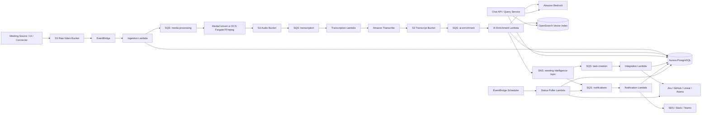
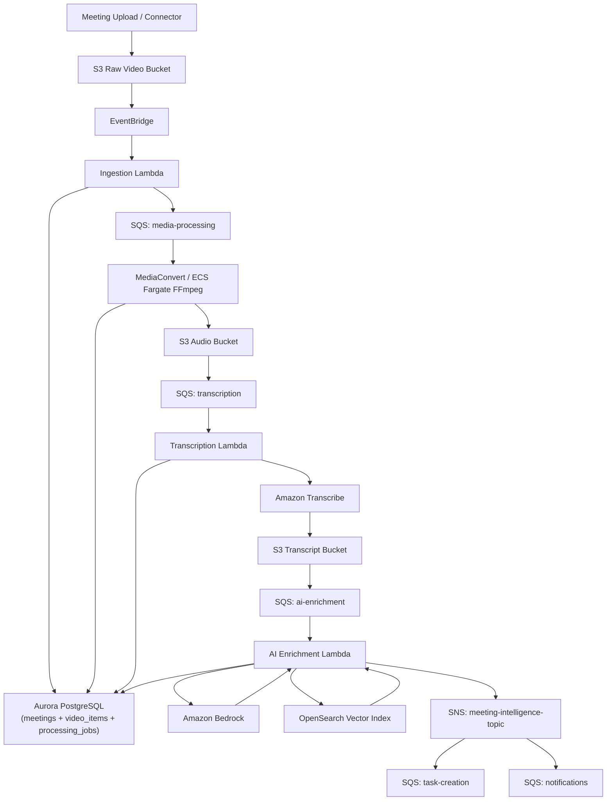

# AI Meeting Intelligence Platform on AWS

## Document Metadata

- Version: `v1.1`
- Status: `Draft`
- Date: `2026-05-06`
- Owner: `Architecture / Platform Team`
- Target Environment: `AWS`
- Architecture Style: `Event-driven microservices`
- Primary Compute Model: `Serverless-first`

## Context

The platform processes meeting recordings and turns them into structured intelligence. It ingests meeting video, extracts audio, transcribes speech, generates summaries, detects topics, finds related meetings, creates actionable work items in external systems, notifies participants, and tracks the lifecycle of created tasks.

The platform also provides a chat interface that allows users to ask questions about a meeting and receive grounded answers using a Retrieval-Augmented Generation (RAG) workflow over transcripts, summaries, decisions, topics, and related meeting context.

The system must be AWS-native, decoupled, asynchronous, and scalable. The core integration pattern is a hybrid `SNS + SQS + Lambda` model, with `Amazon Bedrock` for LLM workloads and AWS-managed services for storage, orchestration, search, and observability.

## Problem Statement & Motivation

Meeting knowledge is usually trapped in recordings and scattered across chat, ticketing systems, and people's memory. Teams lose decisions, repeat discussions, and fail to follow up on action items. Manual note-taking is inconsistent and expensive.

This platform solves that by:

- converting meeting media into searchable knowledge
- generating summaries and action items
- linking current meetings to prior related discussions
- creating bugs, tasks, and features in external systems
- tracking those items after creation
- notifying the right people at the right time
- enabling conversational Q&A over meeting content with source-grounded answers

## Goals

- Build a fully decoupled AWS-native processing platform
- Use `Amazon S3`, `SNS`, `SQS`, `Lambda`, `Aurora PostgreSQL`, `Bedrock`, and related AWS services
- Support asynchronous processing at each stage
- Ensure idempotent, fault-tolerant, replayable workflows
- Store video item details and media lifecycle state in `AuroraDB`
- Support future integrations with `Zoom`, `Teams`, `Google Meet`, `Jira`, `GitHub`, `Linear`, and `Slack`
- Provide structured outputs for search, analytics, and downstream workflows
- Support meeting chat with RAG-based answering

## Non-Goals

- Real-time transcription during live meetings in MVP
- Complex human editing workflows for summaries in MVP
- On-premise deployment
- Multi-cloud portability as a primary goal
- Full BI/reporting layer in MVP

## Scope

In scope:

- Upload or ingest meeting recordings
- Video-to-audio extraction
- Speech-to-text transcription
- LLM-based summarization and structured extraction
- Topic and decision extraction
- Related meeting discovery via semantic search
- External task creation
- Notifications to participants
- Polling and status synchronization of created items
- Search API for meetings and artifacts
- Meeting chat with contextual question answering
- Monitoring, auditability, retries, and DLQs

Out of scope:

- Real-time meeting bot attendance
- Fine-grained user editing of transcript sections
- Advanced org-wide analytics dashboards
- Legal hold / e-discovery workflows
- Offline desktop client

## High-Level Technical Solution

The platform is built as event-driven microservices connected through `Amazon SNS`, `Amazon SQS`, and `Amazon EventBridge`. Each major processing stage is isolated behind a queue and executed by `AWS Lambda` or a managed compute service. Broadcast-style domain events are published through `SNS`, while stage-by-stage processing, retries, and backpressure control are handled through `SQS`. Large media files are stored in `Amazon S3`. Metadata and transactional state are stored in `Amazon Aurora PostgreSQL`. Semantic retrieval uses `Amazon OpenSearch Serverless` or `Aurora pgvector`. LLM workloads run through `Amazon Bedrock`.

The system separates:

- artifact storage
- workflow state
- AI enrichment
- task orchestration
- external integrations
- notification delivery
- item status observation
- RAG retrieval and conversational answering

This keeps failures localized and allows each service to scale independently.

## Architecture Overview



## Video Processing Flow



This is the canonical processing path for a single `video_item`. It shows the media lifecycle from upload through audio extraction, transcription, AI enrichment, vector indexing, and downstream task and notification fan-out. `Aurora PostgreSQL` tracks `video_items` state and derived metadata at each major stage, while `SNS` broadcasts completed intelligence events to independent `SQS` consumer queues.

## Primary AWS Services

- `Amazon S3`
  Raw meeting videos, extracted audio, transcript JSON, derived artifacts
- `Amazon EventBridge`
  Event routing, orchestration triggers, scheduled status sync
- `Amazon SNS`
  Broadcast fan-out for domain events with multiple subscribers
- `Amazon SQS`
  Decoupled messaging, retries, backpressure, DLQs
- `AWS Lambda`
  Stateless service execution for orchestration and processing
- `AWS Step Functions`
  Optional orchestration for long-running workflows and compensations
- `AWS Elemental MediaConvert` or `ECS Fargate`
  Video-to-audio extraction
- `Amazon Transcribe`
  Speech-to-text
- `Amazon Bedrock`
  Summarization, extraction, classification, embeddings, and chat answer generation
- `Amazon Aurora PostgreSQL Serverless v2`
  Transactional metadata and system-of-record state
- `Amazon OpenSearch Serverless`
  Semantic search and related meeting retrieval
- `Amazon SES` and/or webhook integrations
  Notifications
- `AWS Secrets Manager`
  Credentials for external systems
- `Amazon CloudWatch`, `AWS X-Ray`, `CloudTrail`
  Observability and audit

## Microservice Decomposition

### 1. Ingestion Service

Responsibilities:

- validate upload or connector payload
- create initial meeting record
- create `video_items` record in `AuroraDB`
- assign tenant and source metadata
- deduplicate repeated upload events
- enqueue media processing

Inputs:

- `S3 Object Created` event or API request

Outputs:

- `media-processing` queue message
- `meetings`, `video_items`, and `processing_jobs` records

### 2. Media Processing Service

Responsibilities:

- extract audio from video
- normalize to supported codec and sample rate
- write output to audio bucket
- update `video_items.processing_status`
- publish transcription job message

Implementation options:

- preferred for managed workflow: `MediaConvert`
- preferred for custom FFmpeg control: `ECS Fargate`

### 3. Transcription Service

Responsibilities:

- submit audio to `Amazon Transcribe`
- track job progress
- store transcript location
- update media and transcript state in `AuroraDB`
- enqueue AI enrichment after completion

Notes:

- may use `EventBridge` callbacks from transcription completion
- should support diarization and optional PII redaction

### 4. AI Enrichment Service

Responsibilities:

- chunk transcript
- generate summaries
- extract action items, decisions, risks, topics
- classify action items into bug / feature / todo
- create embeddings
- find related meetings
- persist structured outputs
- update `video_items.ai_enrichment_status`

This is the main `Bedrock` consumer.

### Eventing Pattern

- use `SQS -> Lambda` for strict stage-by-stage media processing
- use `SNS -> SQS -> Lambda` when one domain event must fan out to multiple consumers
- keep one queue per downstream consumer to preserve retries, DLQs, and independent scaling

### 5. Task Orchestration / Integration Service

Responsibilities:

- map extracted action items into external issue schemas
- apply idempotency rules
- create tasks in configured systems
- store external IDs and URLs
- publish notification events

### 6. Notification Service

Responsibilities:

- notify participants about summary availability
- notify owners about created tasks
- notify on item status change
- send reminder or escalation messages

### 7. Status Observer Service

Responsibilities:

- poll open tasks in external systems
- update local state
- detect closure, reassignment, or stale items
- publish notifications and audit events

### 8. Search / Query Service

Responsibilities:

- expose APIs for meeting search, transcript lookup, related meetings, and action item status
- combine metadata filtering with vector similarity
- handle meeting chat requests
- retrieve relevant transcript chunks and structured artifacts
- generate grounded answers with citations

### 9. Meeting Chat / RAG Service

Responsibilities:

- accept user questions about a meeting
- retrieve relevant transcript chunks, summaries, topics, decisions, and action items
- optionally expand retrieval to related meetings based on permissions
- call `Bedrock` to generate a grounded answer
- return answer text with citations and confidence metadata
- persist chat sessions and messages if conversation history is enabled

## Detailed Processing Flow

### Flow A: Meeting Processing

1. Recording is uploaded to `S3 raw-video`.
2. `EventBridge` captures the object-created event.
3. `Ingestion Lambda` validates object metadata and creates a `meeting`.
4. `Ingestion Lambda` creates a `video_items` record in `AuroraDB`.
5. `Ingestion Lambda` sends message to `media-processing-queue`.
6. Media service extracts audio and writes it to `S3 audio`.
7. Media service updates `video_items.processing_status`.
8. Media service sends message to `transcription-queue`.
9. Transcription service starts `Amazon Transcribe`.
10. On completion, transcript JSON is stored in `S3 transcript`.
11. Transcription service updates transcript references on the `video_items` record.
12. Completion event sends message to `ai-enrichment-queue`.
13. AI service loads transcript, chunks content, and calls `Bedrock`.
14. AI service stores summary, topics, decisions, action items, and embeddings.
15. AI service queries vector store for related meetings.
16. AI service updates `video_items.ai_enrichment_status`.
17. AI service publishes `meeting.intelligence.generated` to `SNS`.
18. `SNS` fans out to subscribed `SQS` queues such as `task-creation` and `notifications`.

### Flow D: Meeting Chat with RAG

1. User opens the meeting details page and submits a question.
2. Chat API validates tenant and meeting access permissions.
3. Query service loads meeting metadata and optional conversation context from `AuroraDB`.
4. Query service performs vector search against transcript chunks and derived artifacts.
5. Query service retrieves top relevant chunks and structured records such as decisions, topics, and action items.
6. Query service optionally includes related meetings when cross-meeting retrieval is allowed.
7. Query service calls `Bedrock` with retrieved context and answer formatting instructions.
8. Response is returned with citations to transcript segments and artifact references.
9. Chat interaction is optionally stored for analytics, continuity, and audit.

### Flow B: External Task Creation

1. `task-creation-queue` receives extracted action items.
2. Integration service validates destination integration config.
3. Service transforms item into external schema.
4. External item is created in `Jira`, `GitHub`, `Linear`, or `Asana`.
5. Platform stores external task ID, URL, type, status, and timestamps.
6. Notification event is emitted.

### Flow C: Status Observation

1. `EventBridge Scheduler` runs periodic sync for open tasks.
2. Status observer loads open items grouped by integration.
3. Connector calls external APIs to check latest status.
4. Changed statuses are persisted.
5. Notifications are sent when state changes matter.

## Queue Design

Core queues:

- `media-processing-queue`
- `transcription-queue`
- `ai-enrichment-queue`
- `task-creation-queue`
- `notifications-queue`
- `status-sync-queue`

Core topics:

- `meeting-intelligence-topic`
- `task-status-events-topic`

Each queue has:

- a dedicated DLQ
- visibility timeout aligned to worker duration
- redrive policy
- message retention based on operational replay requirements

Recommended message pattern:

- one business event per message
- stable event type
- unique event ID
- tenant ID
- correlation ID
- idempotency key
- artifact references only, not large payloads

Recommended event pattern:

- use `SQS` for sequential processing stages
- use `SNS` for multi-subscriber broadcast events
- subscribe independent `SQS` queues per consumer behind each `SNS` topic

## Event Contract Examples

### Meeting Uploaded

```json
{
  "eventType": "meeting.uploaded",
  "eventVersion": "1.0",
  "eventId": "uuid",
  "occurredAt": "2026-05-06T10:00:00Z",
  "tenantId": "tenant_123",
  "meetingId": "mtg_123",
  "videoItemId": "vid_123",
  "source": "manual_upload",
  "rawVideo": {
    "bucket": "raw-video-bucket",
    "key": "tenant_123/mtg_123/video.mp4"
  },
  "correlationId": "corr_123",
  "idempotencyKey": "tenant_123:vid_123:meeting.uploaded"
}
```

### Transcript Ready

```json
{
  "eventType": "meeting.transcript.ready",
  "eventVersion": "1.0",
  "eventId": "uuid",
  "tenantId": "tenant_123",
  "meetingId": "mtg_123",
  "videoItemId": "vid_123",
  "transcript": {
    "bucket": "transcript-bucket",
    "key": "tenant_123/mtg_123/transcript.json",
    "language": "en-US",
    "speakerDiarization": true
  },
  "correlationId": "corr_123",
  "idempotencyKey": "tenant_123:vid_123:meeting.transcript.ready"
}
```

### Action Items Extracted

```json
{
  "eventType": "meeting.action_items.extracted",
  "eventVersion": "1.0",
  "eventId": "uuid",
  "tenantId": "tenant_123",
  "meetingId": "mtg_123",
  "videoItemId": "vid_123",
  "items": [
    {
      "actionItemId": "ai_001",
      "title": "Fix login timeout issue",
      "type": "bug",
      "owner": "user@example.com",
      "priority": "high",
      "dueDate": null
    }
  ],
  "correlationId": "corr_123"
}
```

### Recommended SNS Fan-Out Cases

- `meeting.intelligence.generated`
  Fan out to task creation, notifications, analytics, and audit consumers
- `task.status.changed`
  Fan out to notifications, dashboards, and reporting consumers
- `meeting.processing.failed`
  Fan out to alerting, audit, and retry orchestration consumers

## Data Model

### Core Business Tables

#### meetings

- `id`
- `tenant_id`
- `source_type`
- `source_external_id`
- `title`
- `organizer_email`
- `scheduled_start_at`
- `recorded_at`
- `duration_seconds`
- `status`
- `created_at`
- `updated_at`

#### video_items

- `id`
- `tenant_id`
- `meeting_id`
- `source_type`
- `source_external_id`
- `original_filename`
- `s3_bucket`
- `s3_key`
- `file_size_bytes`
- `mime_type`
- `video_codec`
- `audio_codec`
- `duration_seconds`
- `width`
- `height`
- `frame_rate`
- `language_hint`
- `checksum`
- `upload_status`
- `processing_status`
- `transcription_status`
- `ai_enrichment_status`
- `audio_s3_key`
- `transcript_s3_key`
- `created_at`
- `updated_at`

Purpose:

- system of record for uploaded media assets
- source of truth for media lifecycle and processing state
- supports multiple recordings per meeting

Suggested statuses:

- `upload_status`: `pending`, `uploaded`, `failed`
- `processing_status`: `queued`, `processing`, `completed`, `failed`
- `transcription_status`: `pending`, `processing`, `completed`, `failed`
- `ai_enrichment_status`: `pending`, `processing`, `completed`, `failed`

Relationship:

- one `meeting` can have one or more `video_items`

#### participants

- `id`
- `meeting_id`
- `tenant_id`
- `email`
- `display_name`
- `role`
- `attended`
- `created_at`

#### transcripts

- `id`
- `meeting_id`
- `video_item_id`
- `tenant_id`
- `language_code`
- `transcript_s3_key`
- `speaker_count`
- `confidence_score`
- `redaction_applied`
- `created_at`

#### summaries

- `id`
- `meeting_id`
- `video_item_id`
- `tenant_id`
- `summary_type`
- `model_id`
- `prompt_version`
- `content`
- `created_at`

#### topics

- `id`
- `meeting_id`
- `video_item_id`
- `tenant_id`
- `label`
- `start_offset_seconds`
- `end_offset_seconds`
- `confidence_score`

#### decisions

- `id`
- `meeting_id`
- `video_item_id`
- `tenant_id`
- `description`
- `owner_email`
- `created_at`

#### action_items

- `id`
- `meeting_id`
- `video_item_id`
- `tenant_id`
- `title`
- `description`
- `item_type`
- `owner_email`
- `priority`
- `due_date`
- `source_excerpt`
- `status`
- `confidence_score`
- `created_at`
- `updated_at`

#### chat_sessions

- `id`
- `tenant_id`
- `meeting_id`
- `created_by`
- `title`
- `created_at`
- `updated_at`

#### chat_messages

- `id`
- `session_id`
- `tenant_id`
- `meeting_id`
- `role`
- `message_text`
- `response_metadata_json`
- `created_at`

#### transcript_chunks

- `id`
- `meeting_id`
- `video_item_id`
- `tenant_id`
- `chunk_index`
- `chunk_text`
- `start_offset_seconds`
- `end_offset_seconds`
- `embedding_ref`
- `created_at`

#### external_tasks

- `id`
- `action_item_id`
- `tenant_id`
- `provider`
- `provider_project_key`
- `external_id`
- `external_url`
- `external_status`
- `last_synced_at`
- `created_at`
- `updated_at`

#### processing_jobs

- `id`
- `meeting_id`
- `video_item_id`
- `tenant_id`
- `job_type`
- `status`
- `attempt_count`
- `error_code`
- `error_message`
- `started_at`
- `finished_at`

#### notifications

- `id`
- `tenant_id`
- `meeting_id`
- `video_item_id`
- `recipient`
- `channel`
- `template_name`
- `status`
- `sent_at`

#### tenant_integrations

- `id`
- `tenant_id`
- `provider`
- `config_reference`
- `status`
- `created_at`

#### audit_events

- `id`
- `tenant_id`
- `entity_type`
- `entity_id`
- `action`
- `actor_type`
- `details_json`
- `created_at`

## AuroraDB Role in the Architecture

`Aurora PostgreSQL` is the transactional system of record for:

- meeting metadata
- video item details
- processing lifecycle states
- transcript references
- summary metadata
- extracted topics, decisions, and action items
- chat sessions, chat messages, and transcript chunk metadata
- external issue mappings
- notification history
- audit history

`S3` stores large binary and document artifacts. `AuroraDB` stores pointers, metadata, and workflow state.

This separation provides:

- normalized metadata
- easier retries and replay
- better observability across processing stages
- support for multiple video assets per meeting
- simpler status reporting in UI and APIs

## Storage Strategy

- `S3 raw-video`
  Original uploaded recordings
- `S3 audio`
  Extracted normalized audio
- `S3 transcript`
  Raw transcription outputs
- `S3 derived-artifacts`
  Optional exported summaries and reports

Retention policy should distinguish:

- raw media retention
- transcript retention
- derived artifact retention
- audit retention

## Bedrock Design

### LLM tasks

- meeting summary
- executive summary
- participant-specific summary
- action item extraction
- bug / feature / todo classification
- decision extraction
- topic extraction
- risk extraction
- title generation
- grounded meeting question answering

### Embedding tasks

- transcript chunk embeddings
- summary embeddings
- topic embeddings
- decision and action item embeddings where useful for retrieval

### Prompting strategy

- store prompt templates in versioned configuration
- include schema-driven output instructions
- require JSON outputs for structured fields
- validate model output before persistence
- use fallback prompt or retry with stricter constraints on parse failure

### Structured output example

```json
{
  "summary": "string",
  "topics": ["string"],
  "decisions": [
    {
      "description": "string",
      "owner": "string|null"
    }
  ],
  "actionItems": [
    {
      "title": "string",
      "description": "string",
      "type": "bug|feature|todo",
      "owner": "string|null",
      "priority": "low|medium|high|critical|null",
      "dueDate": "ISO-8601|null"
    }
  ]
}
```

## Related Meeting Discovery

Approach:

- split transcript into semantic chunks
- generate embeddings
- store vectors with metadata
- query similar chunks for new meeting
- re-rank by tenant, participants, recency, and confidence
- return prior meetings, summaries, and relevant excerpts

Recommended filters:

- same tenant
- optional same team/project
- optional same participants
- recency window
- minimum similarity threshold

## Meeting Chat with RAG

The platform includes a chat capability for answering questions about a meeting using retrieval-augmented generation.

### RAG data sources

- transcript chunks
- summaries
- topics
- decisions
- action items
- optionally related meetings within the same tenant

### Retrieval flow

1. Normalize user question and determine target meeting scope.
2. Embed the question using the selected embeddings model.
3. Query vector store for semantically similar transcript chunks and artifacts.
4. Apply metadata filters for `tenant_id`, `meeting_id`, permissions, and recency.
5. Re-rank results by semantic score and artifact quality.
6. Build a compact prompt context with citations.
7. Ask `Bedrock` to answer only from retrieved context.
8. Return answer with supporting references.

### Guardrails

- answer only from retrieved context
- return "not enough information" when evidence is insufficient
- include citations to transcript chunks or structured artifacts
- do not expose content from meetings the user is not authorized to access
- log retrieval metadata for debugging and quality tuning

### Response shape

```json
{
  "answer": "string",
  "citations": [
    {
      "type": "transcript_chunk",
      "meetingId": "mtg_123",
      "videoItemId": "vid_123",
      "chunkId": "chunk_12",
      "startOffsetSeconds": 320,
      "endOffsetSeconds": 361
    }
  ],
  "confidence": "high|medium|low",
  "usedRelatedMeetings": false
}
```

## API Surface

Recommended APIs:

- `POST /meetings/upload-init`
  Creates upload session and metadata placeholder
- `GET /meetings/{id}`
  Returns meeting state and artifacts
- `GET /meetings/{id}/summary`
  Returns summaries and extracted outputs
- `GET /meetings/{id}/related`
  Returns related meetings
- `GET /meetings/{id}/action-items`
  Returns local and external task mapping
- `GET /video-items/{id}`
  Returns media-specific metadata and processing state
- `GET /search/meetings`
  Metadata and semantic search
- `POST /meetings/{id}/chat`
  Asks a question about a meeting and returns a grounded answer
- `GET /meetings/{id}/chat/sessions`
  Returns existing chat sessions for the meeting
- `GET /chat/sessions/{sessionId}/messages`
  Returns chat history when enabled
- `POST /integrations/{provider}/connect`
  Registers tenant integration
- `POST /tasks/{id}/sync`
  Force status refresh for one task

## Frontend / Hosting

If a UI is included:

- frontend hosting: `Amazon CloudFront + S3` or `AWS Amplify Hosting`
- auth: `Amazon Cognito`
- backend access: `API Gateway`
- asset delivery: signed URLs where needed

Recommended UI modules:

- meeting list
- meeting details
- transcript viewer
- summary and topic view
- meeting chat panel
- related meetings panel
- action item dashboard
- integration settings
- notifications center

## Security Considerations

- encrypt all buckets, queues, databases, and search indexes with `KMS`
- use least-privilege `IAM` roles per Lambda
- keep external API credentials in `Secrets Manager`
- restrict DB and search access to private networking
- apply tenant-level authorization at API and query layers
- redact PII when required
- maintain immutable audit records for processing and outbound actions
- validate webhook signatures for inbound integrations
- protect upload endpoints with authenticated pre-signed URL flows
- enable `CloudTrail` and security monitoring

If compliance is required later:

- add data residency controls
- configurable retention policies
- subject deletion workflows
- compliance-specific logging and approvals

## Reliability and Failure Handling

Design principles:

- at-least-once delivery across queues
- idempotent consumers
- replay-safe workflows
- DLQ isolation
- timeout-aware retries
- compensating actions where external side effects exist

Examples:

- if media extraction fails, retry from `media-processing-queue`
- if task creation fails after partial external creation, store external ID and mark job `partial_success`
- if notification fails, retry independently without blocking meeting completion
- if Bedrock output is invalid JSON, retry with a repair prompt or fallback parser

## Idempotency Strategy

Each service must enforce idempotency using:

- `eventId`
- `idempotencyKey`
- unique DB constraints where applicable
- provider-side duplicate detection for external tasks when possible

Examples:

- one transcript record per `(meeting_id, video_item_id, transcript_version)`
- one external task per `(action_item_id, provider, provider_project_key)`
- one notification per `(meeting_id, video_item_id, recipient, template_name, logical_event)`

## Performance Requirements

Initial targets for MVP:

- support asynchronous processing of at least `1000` meetings/day
- typical meeting completion under `10-20` minutes depending on recording size
- API reads under `500 ms` for metadata-driven endpoints
- related meeting queries under `2 seconds`
- task status sync batch windows under `15 minutes`

These should be refined once usage volume and average recording length are known.

## Monitoring & Observability

Metrics:

- upload count
- queue depth
- Lambda duration and error rate
- media processing duration
- transcription latency
- Bedrock request latency and token usage
- task creation success rate
- notification delivery success rate
- status sync freshness
- DLQ count by service
- chat question volume
- chat answer latency
- retrieval hit quality
- citation coverage rate

Logs:

- structured JSON logs with `tenantId`, `meetingId`, `videoItemId`, `correlationId`, `eventType`
- redact secrets and transcript content where necessary

Tracing:

- `AWS X-Ray` across Lambda/API paths
- correlation IDs propagated through all events

Alerts:

- DLQ message count above threshold
- repeated task creation failures
- transcription backlog growth
- Bedrock throttling or error spikes
- notification delivery degradation

## Testing Strategy

### Unit tests

- event schema validation
- transcript chunking logic
- retrieval ranking logic
- prompt output parsers
- task mapping rules
- notification template selection
- idempotency guards

### Integration tests

- S3 upload to queue flow
- media processing to transcription handoff
- Bedrock structured extraction pipeline
- RAG retrieval and answer generation flow
- external issue creation against mock providers
- status poller sync behavior

### End-to-end tests

- upload sample meeting
- verify transcript generation
- verify summary and action item extraction
- verify meeting chat answers with citations
- verify task creation
- verify notification dispatch
- verify related meeting retrieval

### Non-functional tests

- retry and DLQ behavior
- duplicate event replay
- large file handling
- scaling under queue burst
- chaos testing for external API downtime

## Deployment and Environment Strategy

Environments:

- `dev`
- `staging`
- `prod`

Recommended account structure:

- separate AWS accounts per environment for stronger isolation
- shared CI/CD account optional

Infrastructure as Code:

- `Terraform` or `AWS CDK`
- all queues, buckets, IAM policies, Lambdas, alarms, DBs, and EventBridge rules managed declaratively

CI/CD:

- build, test, package, deploy
- schema migration gating
- environment-specific secrets and config
- canary or phased rollout for critical services

## Rollback Plan

- deploy services independently
- use Lambda versions and aliases for fast rollback
- keep message contracts backward compatible
- disable problematic consumers by event rule or queue subscription if needed
- if prompt changes degrade outputs, roll back to previous prompt version and model config
- if a new integration connector fails, pause its queue path without stopping the rest of the system
- keep DB schema changes backward compatible until rollout is complete

## Implementation Plan

### Phase 1: Platform Foundation

- provision AWS networking, IAM, S3, SQS, Aurora, logging, secrets
- implement ingestion service
- define canonical event schemas
- establish CI/CD and IaC

### Phase 2: Media and Transcription

- implement media extraction
- implement transcription workflow
- persist transcript metadata
- add retry and DLQ handling

### Phase 3: AI Enrichment

- implement transcript chunking
- integrate Bedrock for summary, topics, decisions, and action items
- persist outputs
- add output validation

### Phase 4: Related Meeting Discovery

- implement embeddings pipeline
- store vectors
- add semantic retrieval API

### Phase 5: Meeting Chat with RAG

- implement transcript chunk storage
- implement retrieval service
- implement grounded answer generation
- implement citations in responses
- add chat APIs and UI integration

### Phase 6: External Tasking and Notifications

- implement Jira/GitHub connector abstraction
- create external tasks
- send notifications
- persist syncable task state

### Phase 7: Status Observation

- implement scheduled polling
- update statuses
- add reminder and closure notifications

### Phase 8: UI and Search

- build read APIs
- build dashboard and meeting detail UI
- add filters, search, and related meeting view

## Risks

- transcription quality may vary by audio quality, accent, or overlapping speakers
- LLM extraction may produce inconsistent structure or hallucinated action items
- external task systems differ in schema and rate limits
- semantic similarity quality depends on chunking and embedding model choice
- RAG answer quality depends on retrieval quality and prompt discipline
- large recordings may create long or expensive processing paths
- tenant isolation must be carefully enforced across query, storage, and search layers
- async systems are harder to debug without strong observability discipline

Mitigations:

- use confidence thresholds and human-review flags for low-confidence outputs
- validate structured outputs against JSON schema
- store source excerpts for every extracted action item
- require citations in chat answers and fall back to insufficient-information responses
- enforce per-provider connector adapters with rate-limit handling
- monitor cost and token consumption by tenant and meeting
- use correlation IDs and distributed tracing everywhere

## Alternatives Considered

### Option A: Step Functions-centric orchestration

- pros: strong visibility, explicit workflow control, good for long-running state
- cons: more orchestration coupling, less pure event-driven decomposition
- decision: use `SQS + Lambda` as the default pattern, optionally `Step Functions` for special long-running or compensating workflows

### Option B: Monolithic service

- pros: simpler initial implementation
- cons: weaker decoupling, harder independent scaling, tighter failure coupling
- decision: rejected because it conflicts with the stated architecture requirements

### Option C: ECS-only microservices

- pros: more control over runtime and long jobs
- cons: more operational overhead than serverless-first
- decision: use Lambda by default, with `Fargate` only where media processing requires it

## Dependencies

Internal dependencies:

- shared event schema library
- shared auth / tenant context library
- shared observability and correlation middleware
- shared connector abstraction for external systems

External dependencies:

- `Amazon Transcribe`
- `Amazon Bedrock`
- external issue tracking APIs
- mail/chat providers where needed

## Success Metrics

- percentage of meetings processed successfully end-to-end
- average time from upload to summary ready
- action item extraction precision after human sampling
- chat answer helpfulness and citation accuracy
- rate of successful external task creation
- status sync freshness for open tasks
- search adoption and related meeting click-through
- notification engagement rate

## Open Questions

- Which meeting sources are in MVP: manual upload, Zoom, Teams, Google Meet?
- Which external systems are mandatory in MVP?
- Is the platform single-tenant or multi-tenant SaaS?
- Is a frontend portal required in phase 1?
- Are there compliance constraints such as GDPR or HIPAA?
- What are the expected daily upload volume and average recording size?
- Should low-confidence action items require manual approval before task creation?

## Recommended MVP Decision Set

For a practical first release:

- meeting source: `manual upload`
- task integrations: `Jira` and `GitHub Issues`
- notifications: `email + Slack`
- vector store: `OpenSearch Serverless`
- media processing: `MediaConvert` if supported formats are enough, otherwise `Fargate + FFmpeg`
- auth: `Cognito`
- IaC: `Terraform`
