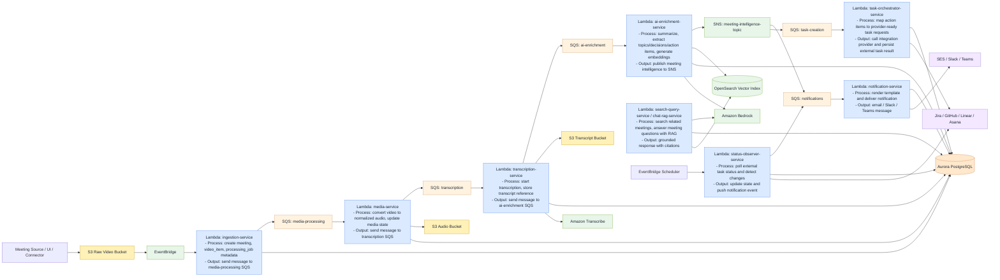
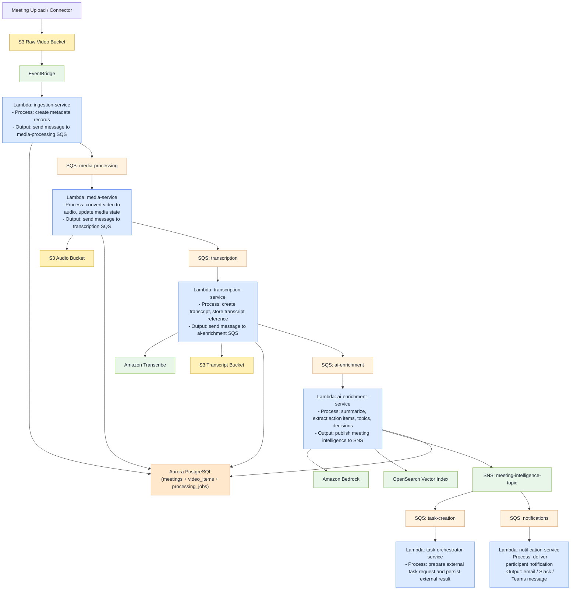
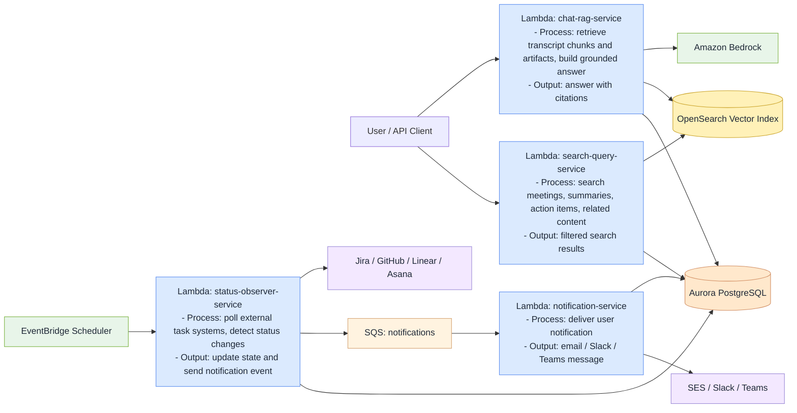

# AI Meeting Intelligence Platform Diagrams

These diagrams show the intended steady-state architecture. The current codebase already implements the queue and persistence scaffolding, plus real `Amazon Transcribe` submission and `Amazon SES` delivery adapters, but `Bedrock`, real media conversion, `OpenSearch`, and true async transcription completion are still pending.

## Architecture Overview

## Video Processing Flow

## Query, Chat, And Observation Flows

